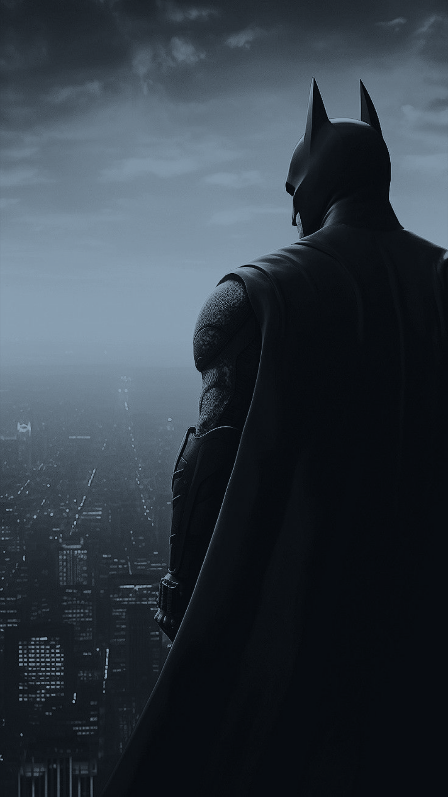
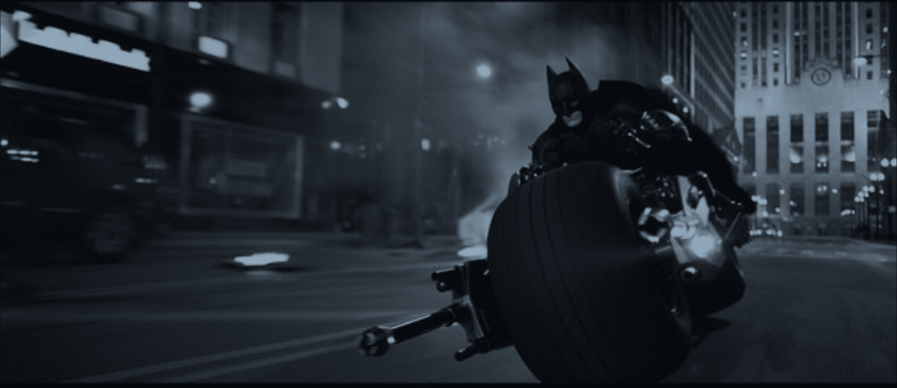

<a href="https://gotham-terminal.pages.dev/"><picture>
<source media="(prefers-reduced-motion: reduce)" srcset="./assets/signal-still.svg" />

</picture></a>

<a href="#01--surveillance-grid"><code>Surveillance</code></a>&nbsp; &middot; &nbsp;<a href="#02--dossier"><code>Dossier</code></a>&nbsp; &middot; &nbsp;<a href="#03--night-watch"><code>Night Watch</code></a>&nbsp; &middot; &nbsp;<a href="#04--case-files"><code>Case Files</code></a>&nbsp; &middot; &nbsp;<a href="#05--field-record"><code>Field Record</code></a>&nbsp; &middot; &nbsp;<a href="#06--public-record"><code>Public Record</code></a>&nbsp; &middot; &nbsp;<a href="#07--raise-the-signal"><code>Raise the Signal</code></a>

<h2>01 / SURVEILLANCE GRID</h2>

<a href="#_"><picture>
<source media="(prefers-reduced-motion: reduce)" srcset="./assets/grid-still.svg" />

</picture></a>

<h2>02 / DOSSIER</h2>

<table>
<tr>

<td width="34%" valign="top">

</td>
<td valign="top">

<h4></h4>

 I’m a Computer Science student at the University of Chicago specializing in Machine Learning.

 I’m interested in software, AI/ML, and research engineering roles. Feel free to reach out if my work seems like a good fit.

<h4></h4>

 I’ve been involved in open source through Google Summer of Code and the Open Source Program Office at UW–Madison.

 I built TicketRadar, a ticket discovery platform that received more than 500 waitlist sign-ups and placed top five in the UW–Madison Transcend pitching competition.

<h4></h4>

 I’ve published work in mechanistic interpretability and language-model behavior.

 I’m interested in AI safety, reasoning, multi-agent systems, and agent monitoring, with broader interests in evaluations, reinforcement learning, and robotics.

</td>
</tr>
</table>

<h2>03 / NIGHT WATCH</h2>

<h2>04 / CASE FILES</h2>

<h3></h3>

<h3> Lexon AI 
SOURCE-GROUNDED AI // MADHACKS 2025 FINALIST</h3>

A source-grounded research interface that links generated claims to supporting evidence and makes the evidence structure explorable through an interactive 3D graph.

&nbsp;&nbsp;

<h3> Google Summer of Code 2026 
OPEN SOURCE // 7 MERGED PRs</h3>

Built an end-to-end benchmarking and ensemble-calibration workflow for PEcAn’s North American carbon reanalysis, culminating in seven merged pull requests across conversion, benchmarking, diagnostics, and regional analysis.

&nbsp;&nbsp;

<h3></h3>

<h3> A Training-Time Sign Flip During the Formation of an IOI Circuit 
ICML 2026 // MECHANISTIC INTERPRETABILITY</h3>

Traces a training-time reversal in how the repeated-name position affects an IOI model, separating early detection from the later emergence of a suppressor mechanism.

&nbsp;&nbsp;

<h3> AniSOAP ASE 
ASE CALCULATOR // CERSONSKY LAB</h3>

Connects AniSOAP descriptors to ASE energy models through an explicit calculator interface, with optional finite-difference forces.

&nbsp;&nbsp;

<h2>05 / FIELD RECORD</h2>

 

<h2>06 / PUBLIC RECORD</h2>

<a href="#_"><picture>
<source media="(prefers-reduced-motion: reduce)" srcset="./assets/gazette-still.svg" />

</picture></a>

<h2>07 / RAISE THE SIGNAL</h2>

<a href="https://gotham-terminal.pages.dev/"><picture>
<source media="(prefers-reduced-motion: reduce)" srcset="./assets/gone-still.svg" />

</picture></a>

